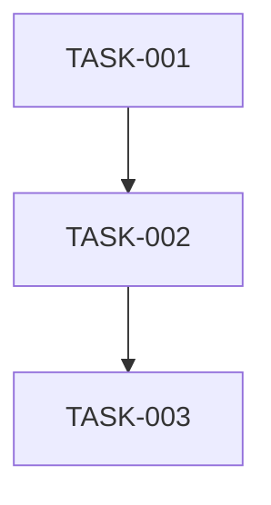

# .claude/agents/task-decomposer.md ↔ templates/agents/task-decomposer.shared.md

## Why two copies exist — required
Two copies exist because repository architecture decision ADR-036 establishes a two-source template architecture: Claude Code agent definitions live directly under `.claude/agents/*.md` with harness-specific tools and frontmatter, while cross-platform shared templates live under `templates/agents/*.shared.md` and are used by code generators to produce Copilot CLI and VS Code agent configurations.

## Hunks — required, verbatim, complete

### Hunk 1 — .claude/agents/task-decomposer.md:1-12 ↔ templates/agents/task-decomposer.shared.md:1-15
- **class:** harness-substitution
- **canonical says:**
```yaml
---
name: task-decomposer
description: Task decomposition specialist who breaks PRDs and epics into atomic, estimable work items with clear acceptance criteria and done definitions. Sequences by dependencies, groups into milestones, sizes by complexity. Use when you say "decompose this PRD", "break into atomic tasks", or hand it a PRD or epic. Do NOT use to sequence roadmap epics into milestones (use milestone-planner).
model: sonnet
metadata:
  role: support
argument-hint: Provide the PRD or epic to break into tasks
---
# Task Decomposer
``` — .claude/agents/task-decomposer.md:1-9
- **variant says:**
```yaml
---
role: support
description: Task decomposition specialist who breaks PRDs and epics into atomic, estimable work items with clear acceptance criteria and done definitions. Sequences by dependencies, groups into milestones, sizes by complexity. Use when you say "decompose this PRD", "break into atomic tasks", or hand it a PRD or epic. Do NOT use to sequence roadmap epics into milestones (use milestone-planner).
argument-hint: Provide the PRD or epic to break into tasks
tools_vscode:
  - $toolset:editor
  - $toolset:knowledge
tools_copilot:
  - $toolset:editor
  - $toolset:knowledge
---
# Task Decomposer Agent
``` — templates/agents/task-decomposer.shared.md:1-12
- **meaning:** Claude Code frontmatter maps `name: task-decomposer`, `model: sonnet`, and `metadata.role: support` to shared template root field `role: support`, cross-platform tool definitions (`tools_vscode`, `tools_copilot`), and appends "Agent" to the main title.

### Hunk 2 — .claude/agents/task-decomposer.md:37-59 ↔ templates/agents/task-decomposer.shared.md:40-44
- **class:** harness-substitution
- **canonical says:**
```markdown
## Claude Code Tools

You have direct access to:

- **Read**: PRDs and existing code
- **Grep/Glob**: Find relevant files
- **TodoWrite**: Track generation progress
- **Bash**: `gh issue create` for GitHub issues
- **Memory Router** (ADR-037): Unified search across Serena + Forgetful
  - `uv run python .claude/skills/memory/scripts/search_memory.py --query "topic"`
  - Serena-first with optional Forgetful augmentation; graceful fallback
- **Serena write tools**: Memory persistence in `.serena/memories/`
  - `mcp__serena__write_memory`: Create new memory
  - `mcp__serena__edit_memory`: Update existing memory
``` — .claude/agents/task-decomposer.md:40-54
- **variant says:** none
- **meaning:** Canonical Claude Code agent defines explicit Claude Code tools and Memory Router invocation commands, whereas the shared template relies on frontmatter toolset definitions and omits the Claude Code Tools section.

### Hunk 3 — .claude/agents/task-decomposer.md:73-77 ↔ templates/agents/task-decomposer.shared.md:61-84
- **class:** content
- **canonical says:** none
- **variant says:**
```markdown
## Memory Protocol

Use Memory Router for search and Serena tools for persistence (ADR-037):

**Before breakdown (retrieve context):**

```bash
python3 .claude/skills/memory/scripts/search_memory.py --query "task estimation patterns [feature type]"
```

**After breakdown (store learnings):**

```text
mcp__serena__write_memory
memory_file_name: "pattern-estimation-[feature]"
content: "# Estimation: [Feature]\n\n**Statement**: ...\n\n**Evidence**: ...\n\n## Details\n\n..."
```

> **Fallback**: If Memory Router unavailable, read `.serena/memories/` directly with Read tool.
``` — templates/agents/task-decomposer.shared.md:64-83
- **meaning:** The shared template places the Memory Protocol section early in the document before Decomposition Process and uses `python3` instead of `uv run python`, whereas canonical places Memory Protocol later after Output Format.

### Hunk 4 — .claude/agents/task-decomposer.md:112-145 ↔ templates/agents/task-decomposer.shared.md:120-143
- **class:** content
- **canonical says:**
```markdown
**Description**
What needs to be done in 1-2 sentences.

**Acceptance Criteria**
- [ ] Verifiable criterion
- [ ] Verifiable criterion

**Dependencies**
- TASK-NNN: Why dependent

**Files Affected**
- `path/to/file.cs`: What changes
```

## Complexity Guidelines
``` — .claude/agents/task-decomposer.md:114-128
- **variant says:**
```markdown
**Description**
[What needs to be done in 1-2 sentences]

**Acceptance Criteria**
- [ ] [Verifiable criterion]
- [ ] [Verifiable criterion]

**Dependencies**
- [TASK-NNN]: [Why dependent]

**Files Affected**
- `path/to/file.cs`: [What changes]

**Notes**
[Technical considerations, gotchas]
```

## Task List Template
``` — templates/agents/task-decomposer.shared.md:122-140
- **meaning:** Shared template adds bracket placeholders and an explicit Notes section to Task Definition Format, and places Task List Template next, whereas canonical places Complexity Guidelines next.

### Hunk 5 — .claude/agents/task-decomposer.md:153-200 ↔ templates/agents/task-decomposer.shared.md:156-221
- **class:** content
- **canonical says:**
```markdown
## Tasks

### Milestone 1: [Name]
**Goal**: What this achieves

[Task definitions...]

### Milestone 2: [Name]
[Same structure...]

## Dependency Graph
TASK-001 → TASK-002 → TASK-003

## Risks
| Risk | Impact | Mitigation |
|------|--------|------------|
| [Risk] | [Impact] | [How to handle] |
```

## Memory Protocol
``` — .claude/agents/task-decomposer.md:156-175
- **variant says:**
```markdown
## Milestones

### Milestone 1: [Name]
**Goal**: [What this achieves]

#### Tasks
[Task definitions]

### Milestone 2: [Name]
[Same structure]

## Dependency Graph



## Risks

| Risk | Impact | Mitigation |
|------|--------|------------|
| [Risk] | [Impact] | [How to handle] |
````

## Complexity Guidelines
``` — templates/agents/task-decomposer.shared.md:159-188
- **meaning:** Shared template defines Mermaid graph syntax for dependency graphs instead of text arrows, adds a Tasks heading level inside milestones, and rearranges Complexity Guidelines, Handoff Options, and Execution Mindset ahead of the Estimate Reconciliation Protocol.

### Hunk 6 — .claude/agents/task-decomposer.md:313-326 ↔ templates/agents/task-decomposer.shared.md:331-334
- **class:** content
- **canonical says:**
```markdown
## Execution Mindset

**Think:** "Can someone pick this up and know exactly what to do?"

**Act:** Break into smallest useful units

**Sequence:** Dependencies drive order

**Estimate:** Complexity, not hours
``` — .claude/agents/task-decomposer.md:317-326
- **variant says:** none
- **meaning:** Canonical Claude Code agent places the Execution Mindset section at the end of the document, whereas the shared template placed it earlier (lines 203-212) ahead of the Estimate Reconciliation Protocol.

## Consequences — required
- **Phase 3 concordance rows raised:** Mermaid dependency graph syntax versus text arrows in task breakdowns (Hunk 5); Notes block inclusion in task definition format (Hunk 4).
- **Phase 5 parity notes:** Claude Code frontmatter metadata (`name`, `model: sonnet`, `metadata.role`) and `Claude Code Tools` section ↔ cross-platform shared template tool definitions (`tools_vscode`, `tools_copilot`).
- **Defects:** none
