# 00 — Lifecycle Specification Overview

The `brain` development lifecycle is a rigorous, artifact-driven software engineering framework synthesized from three foundational agent architectures: Addy Osmani's `agent-skills`, Matt Pocock's `skills`, and RJ Murillo's `ai-agents`. The primary design imperative across the lifecycle is that **state lives on disk in verifiable artifacts, never in conversational context** (D-010, D-230, D-233). Every phase transition enforces strict entry prerequisites and exit criteria verified by automated quality gates (D-237, D-239, D-252, D-512, D-513). Built artifacts maintain dual-target harness parity between canonical Claude Code structures (`skills/`, `commands/`, `agents/`, `.claude-plugin/plugin.json`) and Google Antigravity mirrors (`.agents/skills/`, `.agents/agents/`, `.agents/mcp_config.json`, `.agents/hooks.json`) per D-009.

---

## 1. Architectural Foundations

1. **Artifact-Driven Phase Contracts (D-230, D-233):** No lifecycle state is passed through ephemeral conversation memory. Each phase consumes explicitly versioned on-disk documents and produces structured deliverables according to defined schemas. If a session interrupts, any new agent session resumes directly from disk without context loss.
2. **Quality Gate Pipeline and Andon Cord (D-239, D-513):** Phase boundaries represent hard quality thresholds. Automated gates (`unit-testing-suite`, `pre-commit-validation-checks`, `quality-gate-pipeline`) halt execution immediately via `stop-the-line-andon-cord` upon failure, preventing downstream error cascade.
3. **Subagent Specialization with Fresh Context (D-014, D-017, D-021):** Complex tasks fan out to specialized agent personas operating with fresh context windows, bounded file caps, and deterministic prompt-driven briefs.
4. **Pure Toolchain and Zero Deprecations (D-001, D-003):** The lifecycle standardizes strictly on Bun for script execution and package management, rejecting legacy Node scripts, Python dependencies, and deprecated upstream patterns.
5. **Dual-Target Standard (D-009):** Every operational capability is authored in canonical Claude Code plugin format and mirrored with byte-level fidelity into Antigravity workspace layout, ensuring equal developer ergonomics across both development environments.

---

## 2. Lifecycle Phases

Each phase in the `brain` lifecycle is defined below in a single comprehensive paragraph:

### spec
The `spec` phase is the foundational discovery and problem definition stage where user requirements, system boundaries, and technical constraints are explored, clarified, and formalized into an approved technical specification before execution planning begins (D-620; Addy `skills/spec-driven-development/SKILL.md:12`; Matt `skills/in-progress/writing-fragments/SKILL.md:9`; RJM `.claude/commands/spec.md:1`). Guided by conversational grilling techniques and relentless question-and-answer discipline, the agent interrogates ambiguities, surfaces hidden assumptions, and records non-goals to establish a durable specification artifact (`spec.md`) that anchors all downstream implementation.

### plan-phase
The `plan-phase` is the structured work decomposition stage where an approved technical specification is systematically translated into an ordered, acyclic dependency graph of atomic tasks (D-103; Addy `skills/planning-and-task-breakdown/SKILL.md:8`; Matt `docs/engineering/to-tickets.md:1`; RJM `.claude/commands/plan.md:1`). The planner evaluates system topology, isolates critical-path bottlenecks, and produces an execution plan (`plan.md`) along with actionable task checklists (`tasks/todo.md`), where each discrete task defines explicit acceptance criteria, required file seams, and verifiable completion tests.

### build-phase
The `build-phase` is the core implementation stage of the lifecycle where vertical code slices are constructed, unit tests written, and task checklist items executed against target codebases (D-102; Addy `commands/build.toml:2`, `skills/implement-spec/SKILL.md:1`; Matt `skills/implement/SKILL.md:45`; RJM `.claude/commands/build.md:1`). Operating in a strict test-driven red-green-refactor loop, implementation agents construct minimal functional slices, write regression test coverage alongside production code, and commit atomic changes while maintaining codebase integrity and adhering to architectural rules.

### test
The `test` phase is the comprehensive verification stage where newly implemented code is systematically subjected to automated test suites, regression suites, and environmental validation to prove correctness (D-101; Addy `skills/verify/SKILL.md:5`; Matt `skills/implement/SKILL.md:50`; RJM `.claude/commands/test.md:1`). The test harness runs unit, integration, and end-to-end tests against established baselines, validating that all functional assertions hold true, zero existing behaviors regress, and test coverage metrics satisfy project thresholds before review entry.

### review-phase
The `review-phase` is the multi-perspective inspection and audit stage where completed code slices and verification proofs undergo rigorous adversarial critique before integration (D-104; Addy `skills/review/SKILL.md:1`; Matt `skills/engineering/SKILL.md:5`; RJM `.claude/skills/review/SKILL.md:1`). Specialized personas—including security auditors, code simplifiers, silent failure hunters, and architectural authorities—review code diffs against the specification, evaluating security posture, maintainability, performance implications, and adherence to project conventions.

### ship-phase
The `ship-phase` is the terminal packaging and release stage of the development lifecycle where approved code changes are integrated, tagged, versioned, and deployed to target environments (D-105; Addy `commands/ship.toml:1`; Matt `package.json:12`; RJM `.claude/commands/ship.md:1`). The release pipeline compiles release notes, executes automated changeset bumps, verifies database migration prerequisites, generates deployment runbooks, and executes production rollouts under explicit rollback governance.

### reconnaissance
The `reconnaissance` phase is the preliminary investigation step within the specification workflow where the agent surveys repository architecture, directory layouts, and dependency manifests to establish environmental ground truth (D-115; RJM `.claude/commands/spec.md:20`; Addy `skills/spec-driven-development/SKILL.md:32`). By mapping out module boundaries and tech stacks before eliciting detailed functional requirements, the agent ensures that proposed feature designs align with preexisting architectural conventions and libraries.

### prior-art-review
The `prior-art-review` phase is the exploratory research step within specification where internal solutions, existing abstractions, and third-party package capabilities are investigated to prevent redundant reimplementation (D-116; RJM `.claude/commands/spec.md:35`; Matt `skills/in-progress/writing-fragments/SKILL.md:25`). The agent searches existing codebases for established patterns, evaluates reusable utility functions, and checks external libraries to maximize architectural consistency and minimize new dependency footprint.

### scope-check
The `scope-check` phase is the boundary validation gate within the specification workflow that analyzes proposed feature scope to prevent architectural bloat and multi-module entanglement (D-116; Addy `skills/spec-driven-development/SKILL.md:32`). The agent evaluates requirements against single-responsibility principles, flagging oversized requests that require splitting into distinct architectural milestones or separate feature specifications before implementation planning proceeds.

### specification-drafting
The `specification-drafting` phase is the synthesis step where findings from reconnaissance, prior-art review, and stakeholder grilling are formalized into a comprehensive technical specification document (D-117; Addy `skills/spec-driven-development/SKILL.md:40`; RJM `.claude/commands/spec.md:50`). The authoring subagent structures the document across required technical sections—including architectural overview, user stories, data schemas, API contracts, security implications, and acceptance criteria—for human signoff.

### task-decomposition
The `task-decomposition` phase is the analytical breakdown step within planning where technical specifications are sliced into small, self-contained units of execution sized for single-session completion (D-119; Addy `skills/spec-driven-development/SKILL.md:64`; Matt `docs/engineering/to-tickets.md:20`; RJM `.claude/commands/plan.md:50`). Each decomposed task represents an atomic functional increment containing specific file paths, code seams, and explicit acceptance tests that can be implemented and verified in isolation without cross-task contention.

### execution-planning
The `execution-planning` phase is the topological sequencing step within planning where decomposed tasks are organized into a strict directed acyclic graph defining prerequisites, concurrency limits, and critical milestones (D-118; RJM `.claude/commands/plan.md:183`; Addy `external/api-and-interface-design.md:5`). The planner analyzes data flow and interface dependencies to determine optimal execution order, identifying tasks that can proceed in parallel while sequencing foundation tasks before downstream consumers.

### task-execution
The `task-execution` phase is the active coding step within the build lifecycle where an implementation agent claims an individual task from the plan and constructs the required code changes (D-120; Addy `skills/spec-driven-development/SKILL.md:76`; RJM `.claude/commands/work.md:45`). Guided by the task's acceptance criteria, the worker reads target source files, implements changes at designated seams, verifies intermediate builds, and stages atomic commits accompanied by explanatory commit messages.

### quality-assurance
The `quality-assurance` phase is the automated self-verification step executed by the implementation agent before declaring a build task complete (D-106; Addy `external/api-and-interface-design.md:5`; RJM `.claude/commands/test.md:144`). The agent runs local linters, typecheckers, and scoped test suites against its own diff, proactively correcting syntax errors, type mismatches, and test failures before handing the increment over to the formal test phase.

### phase-routing
The `phase-routing` phase is the meta-orchestration step where the agent determines the appropriate entry point and next operational phase based on user intent and repository state (D-112; Addy `external/index.md:25`; Matt `skills/productivity/SKILL.md:5`). By inspecting active tickets, working tree status, and command invocations, the router agent matches incoming requests to either standard feature workflows, bug diagnosis pipelines, or rapid hotfix pathways.

### engineering-domain
The `engineering-domain` represents the unified catalog classification encompassing all construction, refactoring, diagnostic, and testing capabilities within the lifecycle skill architecture (D-113; Matt `skills/engineering/SKILL.md:5`). It establishes shared coding conventions, tool definitions, and quality expectations across all technical sub-skills, ensuring that implementation practices remain uniform regardless of which specific phase is executing.

### lifecycle
The `lifecycle` encompasses the complete end-to-end software development operating model, governing all phase transitions, artifact handoffs, and quality gates from initial ideation to production deployment (D-111; Addy `skills/spec-driven-development/SKILL.md:14`; Matt `skills/work-in-phases/SKILL.md:12`; RJM `.claude/commands/work.md:10`). It defines the formal state machine, execution boundaries, and human-in-the-loop checkpoints that coordinate autonomous agent activity across multi-session engineering engagements.

### triage-phase
The `triage-phase` is the intake and classification stage for defect reports, customer issues, and runtime exceptions where incoming problems are evaluated for validity, severity, and reproducibility (D-114; Matt `skills/triage/SKILL.md:10`). The triage agent inspects error logs, assesses system impact, assigns priority labels, and routes legitimate bugs into the systematic diagnostic pipeline while filtering out duplicates and user errors.

### defect-reproduction
The `defect-reproduction` phase is the initial diagnostic stage where the engineer creates an isolated, deterministic automated command that reliably triggers the reported defect (D-121; Matt `skills/engineering/diagnosing-bugs/SKILL.md:25`; RJM `.claude/commands/test.md:20`). By capturing the defect in a failing test or executable reproduction script before inspecting implementation code, the agent ensures an objective, indisputable test seam that proves the bug's existence and prevents false-positive resolutions.

### baseline-establishment
The `baseline-establishment` phase is the diagnostic step where reproduction steps are stripped of incidental complexity and steady-state operating parameters are measured (D-122; Matt `skills/engineering/diagnosing-bugs/SKILL.md:48`; RJM `.claude/commands/test.md:45`). The agent eliminates extraneous test fixtures, confirms the minimal load-bearing sequence that induces failure, and records performance and error baselines against which prospective fixes can be compared.

### hypothesis-generation
The `hypothesis-generation` phase is the analytical diagnostic step where the agent formulates multiple ranked, falsifiable hypotheses explaining the root cause of the demonstrated defect (D-123; Matt `skills/engineering/diagnosing-bugs/SKILL.md:70`; RJM `.claude/commands/test.md:70`). Drawing on architecture knowledge and code inspection, the agent articulates specific causal mechanisms that could produce the observed failure, ordering them from highest to lowest probability while defining concrete verification tests for each hypothesis.

### hypothesis-probing
The `hypothesis-probing` phase is the active experimental diagnostic step where temporary instrumentation, probes, and targeted tests are deployed to validate or refute each ranked hypothesis (D-124; Matt `skills/engineering/diagnosing-bugs/SKILL.md:92`; RJM `.claude/commands/test.md:95`). Testing one variable at a time, the agent collects targeted execution telemetry, systematically eliminating invalid theories until the true root cause is conclusively identified and isolated.

### defect-remediation
The `defect-remediation` phase is the corrective diagnostic step where a permanent fix is implemented at the proper architectural seam and verified against the reproduction command (D-125; Matt `skills/engineering/diagnosing-bugs/SKILL.md:115`; RJM `.claude/commands/verify.md:30`). The agent applies minimal necessary code changes, verifies that the original failing test now passes cleanly without introducing regressions into adjacent test suites, and preserves the reproduction test as a permanent regression guard.

### diagnostic-cleanup
The `diagnostic-cleanup` phase is the concluding diagnostic step where all temporary logging statements, debugging probes, and experimental scaffolding introduced during diagnosis are cleanly removed (D-624; Matt `skills/engineering/diagnosing-bugs/SKILL.md:135`). The agent audits diffs against source control to guarantee that no diagnostic artifacts leak into production commits, leaving only the clean fix and permanent regression test in the repository.

### expand-phase
The `expand-phase` is the initial stage of the parallel-change migration pattern where new database columns, data schemas, or API interfaces are added alongside legacy structures (D-621; Addy `skills/deprecation-and-migration/SKILL.md:169`; Matt `docs/engineering/to-tickets.md:50`). During this phase, backwards compatibility is strictly preserved, dual-writing or dual-reading strategies are initialized, and both old and new consumers operate simultaneously without service interruption.

### migrate-phase
The `migrate-phase` is the intermediate stage of the expand-contract pattern where data, external consumers, and internal call sites are progressively transitioned from legacy interfaces to the new structures (D-622; Addy `skills/deprecation-and-migration/SKILL.md:169`; Matt `docs/engineering/to-tickets.md:51`). The agent runs backfill jobs, updates client integration points, monitors migration progress metrics, and verifies that telemetry flows cleanly through the new code pathways.

### contract-phase
The `contract-phase` is the terminal stage of the expand-contract pattern where deprecated legacy interfaces, schema columns, and transitional adapters are permanently decommissioned and deleted (D-623; Addy `skills/deprecation-and-migration/SKILL.md:169`; Matt `docs/engineering/to-tickets.md:52`). Once production telemetry confirms zero traffic to legacy endpoints, the agent removes obsolete code, drops deprecated database columns, and cleans up transitional feature flags to eliminate technical debt.

### deletion-cleanup
The `deletion-cleanup` phase is the final stage of intentional code deletion and architectural pruning workflows where obsolete documentation, dead cross-references, and stale architecture records are purged (D-624; RJM `.claude/skills/adr-review/references/deletion-workflow.md:81`). Following the removal of decommissioned modules or features, the agent systematically audits documentation, glossary terms, and dependency registries to ensure no dangling pointers or confusing legacy guidance remain in the project.

---

## 3. Lifecycle Architecture Diagram

The diagram below illustrates the macro lifecycle progression, specialized diagnostic and migration loops, artifact handoffs, and governing quality gates:

```mermaid
graph TD
    %% Entry and Routing
    Start([User Feature / Problem / Task]) --> PR[phase-routing]
    PR -->|New Feature / Refactor| SpecPhase[spec]
    PR -->|Reported Defect| Triage[triage-phase]
    PR -->|Schema / API Migration| Expand[expand-phase]

    %% Spec Phase Internal
    subgraph Spec [Specification Phase]
        SpecPhase --> Recon[reconnaissance]
        Recon --> PriorArt[prior-art-review]
        PriorArt --> Scope[scope-check]
        Scope --> Drafting[specification-drafting]
        Drafting --> SpecDoc[("spec.md")]
    end

    %% Gate 1: Human Confirmation & Prerequisite
    SpecDoc --> GateSpec{{"Gate: ask-first-confirmation-gate<br/>& front-gate-prerequisite"}}
    GateSpec -->|Approved| PlanPhase[plan-phase]
    GateSpec -->|Revisions Needed| SpecPhase

    %% Plan Phase Internal
    subgraph Plan [Planning Phase]
        PlanPhase --> Decomp[task-decomposition]
        Decomp --> ExecPlan[execution-planning]
        ExecPlan --> PlanDoc[("plan.md & tasks/todo.md")]
    end

    %% Gate 2: Completion Criteria Check
    PlanDoc --> GatePlan{{"Gate: completion-criteria-quality-gate"}}
    GatePlan -->|Validated Acyclic Graph| BuildPhase[build-phase]
    GatePlan -->|Gaps in Criteria| PlanPhase

    %% Build Phase Internal
    subgraph Build [Build Phase]
        BuildPhase --> TaskExec[task-execution]
        TaskExec --> RedGreen["Red-Green-Refactor Loop"]
        RedGreen --> QA[quality-assurance]
        QA --> CodeDiff[("Source Diffs & Unit Tests")]
    end

    %% Gate 3: Andon Cord & Unit Tests
    CodeDiff --> GateBuild{{"Gate: unit-testing-suite<br/>& stop-the-line-andon-cord"}}
    GateBuild -->|Pass| TestPhase[test]
    GateBuild -->|Fail / Broken Seam| BuildPhase

    %% Test Phase Internal
    subgraph TestP [Test Phase]
        TestPhase --> RegressionSuite["Automated Regression Suite"]
        RegressionSuite --> TestReport[("test-results.md & Coverage")]
    end

    %% Gate 4: Pre-Commit & Quality Gate Pipeline
    TestReport --> GateTest{{"Gate: quality-gate-pipeline<br/>& pre-commit-validation-checks"}}
    GateTest -->|Zero Regressions| ReviewPhase[review-phase]
    GateTest -->|Regression Detected| BuildPhase

    %% Review Phase Internal
    subgraph ReviewP [Review Phase]
        ReviewPhase --> Panel["Six-Role Review Panel<br/>(Security, Simplifier, Architect, etc.)"]
        Panel --> ReviewDoc[("review-report.md")]
    end

    %% Gate 5: Review Gate
    ReviewDoc --> GateReview{{"Gate: self-audit-round-cap (<=3)"}}
    GateReview -->|Approved| ShipPhase[ship-phase]
    GateReview -->|Changes Requested| BuildPhase

    %% Ship Phase Internal
    subgraph ShipP [Ship Phase]
        ShipPhase --> ChangesetBump["Changeset & Version Bump"]
        ChangesetBump --> ReleaseArtifacts[("Release Tag & Release Notes")]
        ReleaseArtifacts --> DeployProd["Production Deployment"]
    end

    DeployProd --> Complete([Completed Feature])

    %% Diagnostic & Bug Workflow Subgraph
    subgraph Diagnosis [Defect Diagnosis & Remediation Loop]
        Triage --> Repro[defect-reproduction]
        Repro --> Baseline[baseline-establishment]
        Baseline --> HypoGen[hypothesis-generation]
        HypoGen --> HypoProbe[hypothesis-probing]
        HypoProbe --> Remediation[defect-remediation]
        Remediation --> DiagCleanup[diagnostic-cleanup]
    end
    DiagCleanup -->|Verified Fix & Test| TestPhase

    %% Migration Workflow Subgraph
    subgraph Migration [Expand-Contract Parallel Change Loop]
        Expand --> Migrate[migrate-phase]
        Migrate --> Contract[contract-phase]
        Contract --> DeletionClean[deletion-cleanup]
    end
    DeletionClean --> ReviewPhase

    %% Styling
    classDef phase fill:#2b3a4a,stroke:#4a90e2,stroke-width:2px,color:#ffffff;
    classDef gate fill:#5c3b1e,stroke:#f5a623,stroke-width:2px,color:#ffffff;
    classDef artifact fill:#1e3d2f,stroke:#7ed321,stroke-width:2px,color:#ffffff;
    class SpecPhase,PlanPhase,BuildPhase,TestPhase,ReviewPhase,ShipPhase,Triage,Expand,Migrate,Contract phase;
    class GateSpec,GatePlan,GateBuild,GateTest,GateReview gate;
    class SpecDoc,PlanDoc,CodeDiff,TestReport,ReviewDoc,ReleaseArtifacts artifact;
```

