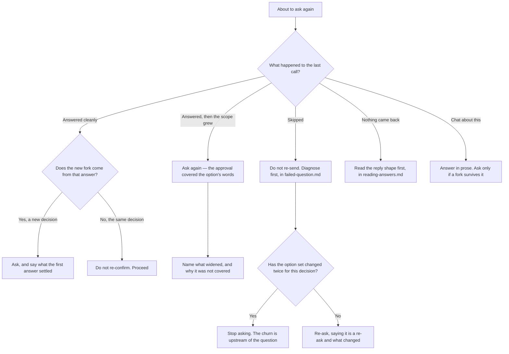

# A run of questions

Open this when you are about to ask a second time inside one piece of work. One
call is a question; several calls are a run, and a run has properties no single
call has — the reader's sense of how long this goes on, what an earlier answer
still authorises, and whether the picture they built two calls ago is still the
picture you are working from.

Everything below turns on what happened to the previous call, because the branches
want opposite fixes. Re-sending repairs a call that was never seen and makes a call
that was skipped worse.

## Table of Contents

- [Tell the reader whether this is bounded](#tell-the-reader-whether-this-is-bounded)
- [Say what kind of run this is, and update it when that changes](#say-what-kind-of-run-this-is-and-update-it-when-that-changes)
- [An approval covers what the option said, and nothing more](#an-approval-covers-what-the-option-said-and-nothing-more)
- [A clean answer can earn a follow-up](#a-clean-answer-can-earn-a-follow-up)
- [Re-asking the same decision](#re-asking-the-same-decision)
- [The reader's picture drifts, and yours does not](#the-readers-picture-drifts-and-yours-does-not)

## Tell the reader whether this is bounded

A reader on the fourth dialog of an unannounced series cannot tell whether to invest
thought here or save it for something later. That is the real problem, and it is not
ignorance of a total — it is not knowing whether the run ends. A reader who knows
the run is bounded stops rationing.

So the obligation is this: **never assert a total you cannot stand behind, and never
leave the reader unable to tell whether the run is bounded.** A count is one way to
satisfy it, not the requirement itself.

A wrong count is worse than no count, because a count is a promise. Say `3 of 5` and
then ask twelve, and the reader has not merely disbelieved that one clause — they
have learned your counts are noise and they stop reading them. This is the same
failure as a `(Recommended)` marker on a coin flip: a signal that proves unreliable
does not fail once, it trains the reader to ignore the signal.

Often the total is genuinely unknowable in advance, because each answer opens or
closes branches. Say the shape at whatever precision is honest:

| What you actually know | What to say |
|---|---|
| A known set | `Finding 3 of 11, two fixed so far.` |
| A shape but no number | `Third of several on the migration.` |
| A bounded guess | `One of two or three more, depending on this answer.` |
| **The run is ending** | `This is the last one I have.` |
| Genuinely open | `I do not know how many more — this answer may open others.` |

All five go in the **question text**. The dialog covers the conversation, so a
position stated in the message above the call is a position the reader never sees —
which is the body's first Gotcha, and the reason this is worth saying twice.

The terminal signal is the most valuable of the five and the cheapest to give. A
reader who knows a run has ended spends freely on the last question instead of
holding something back for a next one that never comes.

## Say what kind of run this is, and update it when that changes

Before the second call, say what shape the work has: a fixed set of decisions, an
open branch where each answer may open others, or a single question you expect to
be the only one. That is answerable even where a count is not, and it is what lets
the reader calibrate.

Then say so when it changes. An estimate you quietly exceed does the same damage as
a wrong count, and for the same reason — the reader stops trusting the framing
rather than just that one estimate. `I said two or three; this answer opened a
fourth` costs a clause and keeps the signal worth reading.

Where the work needs more decisions than it is worth asking about, that is a finding
about the work rather than a licence to keep asking. Take the rest yourself on the
terms Section 1 of SKILL.md sets out — decide, state the evidence, say what would
change your mind — and put them in prose, where the reader can overrule you cheaply.

## An approval covers what the option said, and nothing more

This is the rule most often lost across a run, because nothing about a clean answer
feels like a boundary.

Quote the chosen option's own words back when you act on it, rather than
paraphrasing. Paraphrase is where a narrow approval quietly becomes a broad one:
`Rebuild now` becomes `rebuild and reindex`, and the reader agreed to the first.

Adjacent work that obviously follows was not approved. Obviousness is your view of
it, and the reader's view is the one that consented. Where the work has grown past
what the option said, that is a new question, and it is a cheap one — name what
widened and why the first answer does not reach it.

## A clean answer can earn a follow-up

`reading-answers.md` says not to re-confirm a decision the reader has already made,
and that is right. It is not a rule against asking anything else.

The two are different acts. Re-confirming asks the same decision twice and spends
the reader's attention on nothing. A follow-up asks a decision the first answer
created — the answer opened a fork that did not exist before, or resolved one
question into a choice inside it. That question is as legitimate as the first, and
withholding it means guessing at something the reader would have settled in one
keystroke.

The test: could you have asked this before their answer? If yes, you are
re-confirming. If no, it is a new fork and it is yours to raise. The stated
exception is the confirming question Section 5 of SKILL.md requires on a
destructive or one-way pick — you could have asked it before, and you ask it
anyway.

## Re-asking the same decision

Say that a re-ask is a re-ask, and what changed. Without that the reader cannot
tell your second attempt from a duplicate, and a duplicate reads as the dialog
having failed rather than as you having listened.

Where the options changed underneath you — because something you learned since
removed one, or added one — say so and say why. A reader who chose from three
options and now sees four different ones has no way to know whether their earlier
thinking still applies.

Stop when the option set has changed twice for the same decision. At that point the
churn is upstream of the question: the thing being decided is not stable, and no
wording fixes a question about a moving target. Go and stabilise it, or decide it
yourself and say so.

## The reader's picture drifts, and yours does not

You have been in this work continuously. The reader has not — they answered one
dialog, went back to something else, and arrived at this one with whatever they
remember. Across a run that gap widens every call.

So each call restates its own anchor: what is being decided and what makes it
matter, in the question text, even when the previous call said it. A clause of
repetition is cheaper than a wrong answer, and the reader cannot scroll back to
check what they were told.

Where a later question depends on an earlier answer, name the answer rather than
alluding to it. `You chose to rebuild the index inside the migration` costs one
clause and removes the reader's need to remember which of two things they picked.
